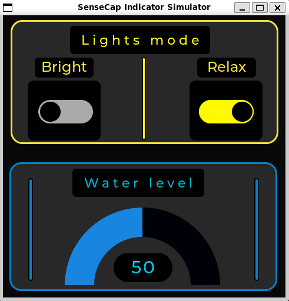

# SenseCAP Indicator D1

[](LICENSE)
[](https://docs.espressif.com/projects/esp-idf/)
[](https://en.wikipedia.org/wiki/C99)

A pure C firmware for the SeeedStudio SenseCAP Indicator D1 IoT device with LVGL UI, WiFi, and MQTT support.

## Overview

This firmware targets the [SenseCAP Indicator D1](https://www.seeedstudio.com/SenseCAP-Indicator-D1-p-5642.html), a smart IoT display device featuring a 480x480 circular touchscreen. The architecture uses a **dual-core approach**:

- **ESP32-S3** (240MHz, 8MB flash): Runs this firmware (ESP-IDF + C)
- **RP2040** (133MHz, 2MB flash): Handles display/touch driver firmware

### UI Preview



The UI features a water tank monitor with visual arc display, toggle switches for Bright/Relax light modes, and real-time MQTT connectivity status.

```
┌─────────────────────────────────────────────────────────────┐
│                    SenseCAP Indicator D1                    │
├─────────────────────────────────────────────────────────────┤
│  ┌──────────────┐              ┌─────────────────────────┐   │
│  │   ESP32-S3   │              │         RP2040         │   │
│  │ ┌──────────┐ │   UART/SPI   │ ┌───────────────────┐  │   │
│  │ │ C/LVGL   │ │◄────────────►│ │ Display Driver    │  │   │
│  │ │ UI Layer │ │              │ │ Touch Controller  │  │   │
│  │ └──────────┘ │              │ └───────────────────┘  │   │
│  │ ┌──────────┐ │              └─────────────────────────┘   │
│  │ │    C     │ │                                          │
│  │ │ Backend  │ │  ┌───────────┐    ┌────────────────┐      │
│  │ └──────────┘ │  │ 802.11    │◄──►│                │      │
│  │              │  │ b/g/n     │    └────────────────┘      │
│  └──────────────┘  └───────────┘                              │
└─────────────────────────────────────────────────────────────┘
```

## Features

- **Pure C Architecture**: C/LVGL UI + C business logic
- **Responsive UI**: 480x480 RGB touchscreen with real-time water level visualization
- **Connectivity**: WiFi (802.11 b/g/n) and MQTT pub/sub
- **Smart Home Ready**: Bidirectional MQTT communication
- **Dual Light Modes**: Bright and Relax with mutual exclusion
- **Water Tank Monitor**: Visual arc display with color-coded alerts

## Quick Start

### Prerequisites

- [ESP-IDF v5.0+](https://docs.espressif.com/projects/esp-idf/en/latest/esp32/get-started/index.html)
- USB-C cable for programming

### Clone and Build

```bash
# Clone repository
git clone https://github.com/RakiDelmoro/sensecap-indicator-d1.git
cd sensecap-indicator-d1

# Setup ESP-IDF (shallow clone for faster setup)
git clone --depth 1 --branch v5.0.2 --recursive https://github.com/espressif/esp-idf.git ~/esp-idf
cd ~/esp-idf && ./install.sh esp32s3
. ./export.sh

# Build firmware
cd /workspaces/sensecap-indicator-d1/firmware
idf.py set-target esp32s3
idf.py build

# Flash and monitor
idf.py flash monitor
```

### Configuration

Configure WiFi and MQTT via `idf.py menuconfig` under "SenseCAP Indicator Configuration":

```bash
idf.py menuconfig
# Navigate to: Component config → SenseCAP Indicator Configuration
```

Or edit `firmware/sdkconfig.defaults`:

```
CONFIG_WIFI_SSID="your_wifi_ssid"
CONFIG_WIFI_PASSWORD="your_wifi_password"
CONFIG_MQTT_BROKER_URL="mqtt://broker.hivemq.com:1883"
```

## Project Structure

```
sensecap-indicator-d1/
├── firmware/              # ESP-IDF firmware (pure C)
│   ├── main/             # C application entry point
│   │   ├── main.c        # Application init
│   │   ├── wifi_manager.c/h
│   │   ├── display_driver.c/h
│   │   └── touch_driver.c/h
│   ├── ui/               # LVGL UI (generated by SquareLine Studio)
│   │   ├── screens/
│   │   │   └── ui_Screen_1.c/h    # Main screen
│   │   ├── ui.c/h                 # UI initialization
│   │   └── ui_helpers.c/h
├── simulator/            # LVGL simulator (PC development)
│   └── src/main.c
└── README.md
```

## Architecture

### Architecture Overview

The firmware uses a pure C architecture with clear separation between UI and business logic:

```
┌────────────────────┐                      ┌────────────────────┐
│      UI Layer      │ ◄──────────────────► │   Backend Layer    │
├────────────────────┤                      ├────────────────────┤
│ ui_event handlers  │                      │ Light state mgmt   │
│ LVGL widgets       │  backend_set_bright()│ MQTT pub/sub       │
│ Display updates    │  backend_set_relax() │ Business logic     │
└────────────────────┘                      └────────────────────┘
         │                                           │
         │  ui_set_water_level()                     │
         │  ui_set_bright_state()                    │ publish_light_state()
         │  ui_set_relax_state()                     │
         ▼                                           ▼
┌─────────────────────────────────────────────────────────────┐
│                        MQTT Broker                           │
│  sensecap/indicator/light/state  (publish)                  │
│  sensecap/indicator/water/level  (subscribe)                │
└─────────────────────────────────────────────────────────────┘
```

### UI Design

The interface consists of two main regions on a 480x480 circular display:

```
┌─────────────────────────────────────────┐
│         480x480 Circular Display        │
├─────────────────────────────────────────┤
│                                         │
│   ┌───────────────────────────────────┐   │
│   │        Lights Mode Section        │   │
│   │      (Top: y = -127, h = 211)    │   │
│   │                                   │   │
│   │   [Lights mode]           Yellow │   │
│   │                                   │   │
│   │   ┌─────────┐     ┌─────────┐    │   │
│   │   │ Bright  │     │  Relax  │    │   │
│   │   │  [OFF]  │────►│  [OFF]  │    │   │
│   │   │ Switch  │     │ Switch  │    │   │
│   │   └─────────┘     └─────────┘    │   │
│   │      (-136)          (+139)     │   │
│   └───────────────────────────────────┘   │
│                [Divider]                  │
│   ┌───────────────────────────────────┐   │
│   │      Water Level Section          │   │
│   │      (Bottom: y = +119, h = 219)   │   │
│   │                                   │   │
│   │      [Water level]        Cyan   │   │
│   │                                   │   │
│   │            ╭──────────╮           │   │
│   │           ╱            ╲          │   │
│   │          │   ┌────┐    │         │   │
│   │          │   │ 50 │    │         │   │
│   │          │   └────┘    │         │   │
│   │           ╲____________╱          │   │
│   │                                   │   │
│   │      Arc: 180°-360° (semicircle) │   │
│   │      Color: Blue (>20%)           │   │
│   │              Orange (10-20%)      │   │
│   │              Red (<10%)            │   │
│   └───────────────────────────────────┘   │
│                                         │
└─────────────────────────────────────────┘
```

#### UI Components

| Component | Type | Dimensions | Position | Purpose |
|-----------|------|------------|----------|---------|
| `LightContainer` | Panel | 455x211 | (0, -127) | Lights mode section |
| `ArcContainer` | Panel | 455x219 | (-2, 119) | Water level section |
| `BrightSwitch` | Switch | 93x40 | (-134, -76) | Bright mode toggle |
| `RelaxSwitch` | Switch | 93x40 | (139, -76) | Relax mode toggle |
| `WaterTankArc` | Arc | 618x264 | (174, 219) | Water level visualization |
| `WaterLevel` | Label | auto | (-2, 188) | Numeric level display |
| `ui_Panel5` | Divider | 7x141 | (-1, -99) | Visual separator |

#### Color Scheme

| Element | Color | Hex |
|---------|-------|-----|
| Background | Black | `#0B0B0B` |
| Panel Background | Dark Gray | `#282828` |
| Lights Border | Yellow | `#F1E144` |
| Water Border | Cyan | `#0087C8` |
| Water Arc (Normal) | Blue | `#1F84D8` |
| Water Arc (Low) | Orange | `#FFA500` |
| Water Arc (Critical) | Red | `#FF0000` |
| Switch ON | Yellow | `#FFF800` |
| Text - Lights | Yellow | `#FFF526` |
| Text - Water | Cyan | `#00C7EF` |

#### Interaction Flow

1. **Light Mode Switching**:
   - Tapping `BrightSwitch` sets state → calls `backend_set_bright()` → publishes MQTT → if ON, turns OFF `RelaxSwitch`
   - Tapping `RelaxSwitch` sets state → calls `backend_set_relax()` → publishes MQTT → if ON, turns OFF `BrightSwitch`

2. **Water Level Updates**:
   - MQTT message received → `backend_update_water_level()` → `ui_update_water_level_async()` → Arc updates + color change

3. **State Persistence**:
   - Backend maintains state variables (`bright_state`, `relax_state`, `water_level`)
   - UI state syncs via callbacks from backend

## MQTT Topics

| Topic | Direction | Payload | Description |
|-------|-----------|---------|-------------|
| `sensecap/indicator/light/state` | Publish | `{"mode":"bright\|relax","state":0\|1}` | Light state changes |
| `sensecap/indicator/water/level` | Subscribe | `{"level":0-100}` | Water tank percentage |

## Hardware Specifications

| Component | Specification |
|-----------|--------------|
| MCU | ESP32-S3 (Xtensa dual-core @ 240MHz) |
| Co-processor | RP2040 (ARM Cortex-M0+ @ 133MHz) |
| Flash | 8MB (ESP32-S3) + 2MB (RP2040) |
| Display | 480x480 RGB LCD, 3.95" |
| Display Driver | ST7701S |
| Touch | GT911 Capacitive |
| WiFi | 802.11 b/g/n |
| Power | 5V DC, 1A |

## Development

### Using the Simulator

The LVGL simulator allows UI development on PC before flashing to hardware:

```bash
cd simulator
./build.sh
./build/sensecap-simulator
```

### Code Organization

```
┌─────────────────────────────────────────────────────────────┐
│                     Application Flow                         │
├─────────────────────────────────────────────────────────────┤
│                                                             │
│  1. Boot → main.c initializes display, touch, WiFi          │
│                                                             │
│  2. Setup → backend_init() called                           │
│                                                             │
│  3. UI    → lv_disp_load_scr(ui_Screen_1)                   │
│                                                             │
│  4. Loop  → LVGL event loop handles:                        │
│             • Touch events → UI callbacks                   │
│             • MQTT messages → C backend                     │
│             • State changes → Callback updates                │
│                                                             │
└─────────────────────────────────────────────────────────────┘
```

### Key Files Reference

| File | Purpose |
|------|---------|
| `firmware/main/main.c:45` | Application entry point |
| `firmware/main/main.c:120` | UI initialization call |
| `firmware/ui/screens/ui_Screen_1.c:82` | Screen initialization |
| `firmware/ui/screens/ui_Screen_1.c:40` | Event handlers |
| `firmware/main/backend/backend.c:35` | Backend init |
| `firmware/main/backend/backend.c:51` | Bright mode handler |

## License

MIT License - See [LICENSE](LICENSE) file for details.

## References

- [SenseCAP Indicator D1 Product Page](https://www.seeedstudio.com/SenseCAP-Indicator-D1-p-5642.html)
- [ESP-IDF Programming Guide](https://docs.espressif.com/projects/esp-idf/en/latest/esp32s3/index.html)
- [LVGL Documentation](https://docs.lvgl.io/8.3/)

---

**Maintainer**: RakiDelmoro  
**Version**: 1.0.0  
**Last Updated**: 2024
